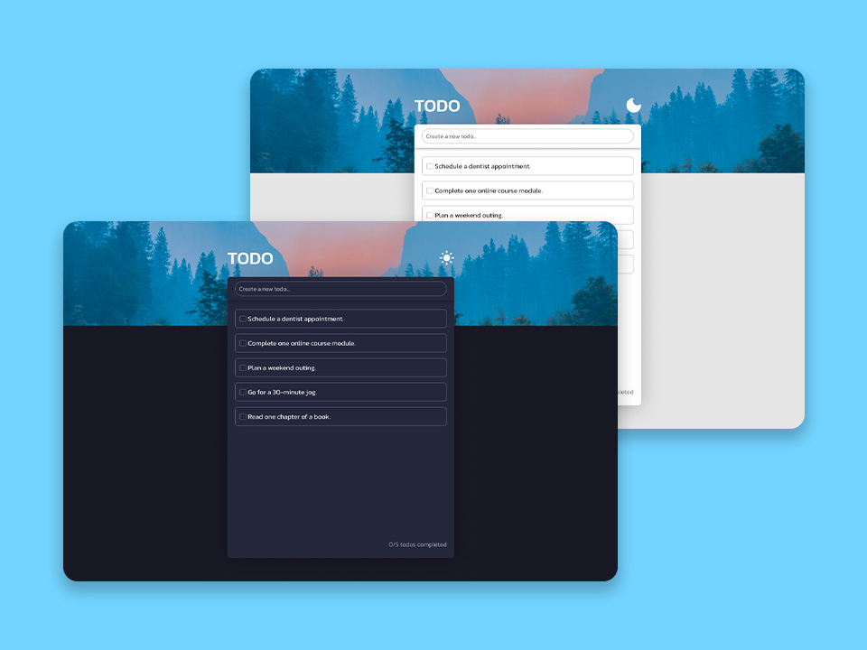

# Todo App Project

Application for easily adding and deleting tasks, with a light/dark mode toggle.

## Hello to [BigDevSoon](https://bigdevsoon.me/) 👋

## Project brief

Dive into the world of productivity and design with **Todo App**. This project empowers you to build a streamlined, user-friendly task management application. Experience the satisfaction of creating an application where users can effortlessly manage their daily tasks. The project's focus on essential features like adding, deleting, and marking tasks, combined with a sleek light/dark mode toggle, makes it an ideal choice for those looking to enhance their skills in creating practical and visually appealing web applications.

### Requirements

- Add UI container with a background image (25% height), dark background (75%), a title "TODO", and a sun icon for the dark theme. Add an input field for new todos with placeholder text and an empty state image with text for no tasks.
- Enable adding tasks with an input field. Show a "Add todo" button when typing in the field. Once a task is added, clear the input and update the task list.
- Implement a hover feature to reveal an "X" icon for task deletion. Ensure tasks can be removed, reverting to the empty state if all are deleted.
- Introduce checkboxes for task completion, with a strikethrough effect on completed tasks. Sort tasks with uncompleted ones first. Display a counter (e.g., "2/4 todos completed") in the bottom right, hiding it in the empty state.
- Create a toggle for light and dark modes with interactive sun and moon icons. Ensure the theme of the app changes according to the selected mode with an animation.

